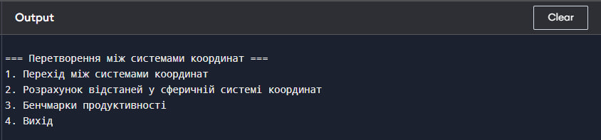
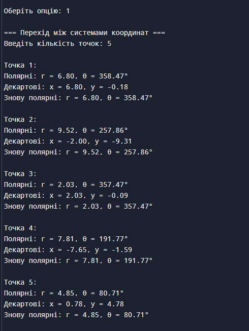
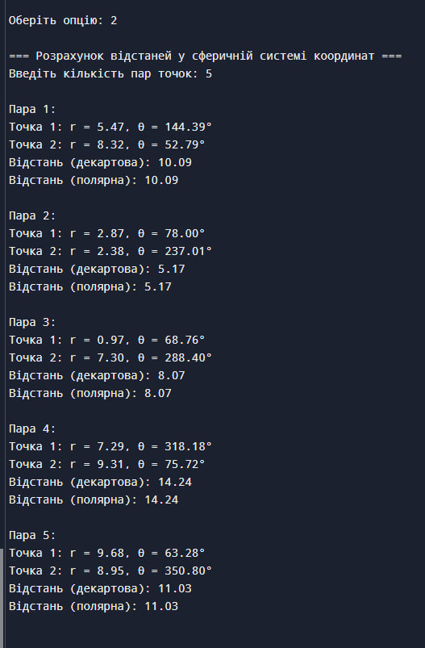
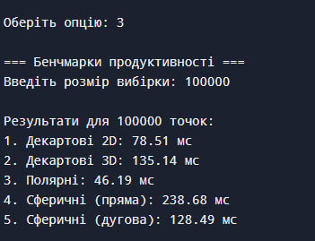

# Лабораторна робота №3: Реалізація перетворень між системами координат

## Мета роботи
Ознайомитися з різними системами координат (декартовою, полярною та сферичною) та отримати практичні навички у переході між ними. Визначити обчислювальну ефективність розрахунку відстаней у цих системах координат через бенчмаркінг.

## Хід роботи

### 1. Запуск та інтерфейс програми
При запуску програми користувачу надається меню з чотирма опціями:
1. Перехід між системами координат
2. Розрахунок відстаней у сферичній системі координат
3. Бенчмарки продуктивності
4. Вихід

Інтерфейс програми розроблено таким чином, щоб забезпечити простий та інтуїтивно зрозумілий доступ до всіх функцій:

  
   
  <em>Рис. 1 - Головне меню програми з опціями вибору режиму роботи</em>

### 2. Перетворення координат
При виборі першої опції програма демонструє можливості перетворення між різними системами координат. У цьому режимі було проведено тестування на п'яти різних точках, кожна з яких пройшла повний цикл перетворень:
- з полярних координат у декартові
- з декартових назад у полярні
- перевірка точності перетворень

Результати демонструють високу точність перетворень, що підтверджується співпадінням початкових та кінцевих координат після повного циклу перетворень:

  
   
  <em>Рис. 2 - Демонстрація перетворень координат для п'яти тестових точок</em>

#### 3. Розрахунок відстаней
У другому режимі роботи програма виконує розрахунок відстаней між парами точок у різних системах координат. Особливу увагу приділено порівнянню результатів обчислень у декартовій та полярній системах. Для кожної пари точок програма розраховує:
- Відстань у декартовій системі координат
- Відстань у полярній системі координат
- Порівняння результатів для верифікації точності

Результати обчислень демонструють стабільну точність та узгодженість між різними методами розрахунку:

  
   
  <em>Рис. 3 - Результати обчислення відстаней між парами точок</em>

### 4. Аналіз продуктивності
Третій режим роботи програми присвячений бенчмаркінгу різних методів обчислення. Тестування проводилося на вибірці з 100,000 точок для забезпечення статистичної значущості результатів. Вимірювання включали:
- Час обчислень у двовимірній декартовій системі
- Час обчислень у тривимірній декартовій системі
- Час обчислень у полярній системі
- Час обчислень прямої відстані у сферичній системі
- Час обчислень дугової відстані у сферичній системі

  
   
  <em>Рис. 4 - Результати бенчмаркінгу різних методів обчислення</em>

## Висновки

На основі проведених тестів можна зробити кілька важливих висновків. Перетворення між полярними та декартовими координатами виконуються з високою точністю, до сотих часток, а зворотні перетворення демонструють лише мінімальну похибку округлення. Система залишається стабільною при роботі з різними діапазонами значень.

Методи розрахунку відстаней у декартовій і полярній системах дають однакові результати, тоді як сферична система дозволяє обчислювати дугові відстані. Усі методи забезпечують достатню точність для практичного застосування.

Аналіз продуктивності показав, що найшвидшим є метод обчислень у полярній системі координат, який займає 46.19 мс. Найбільше часу потребують обчислення у сферичній системі – 238.68 мс, тоді як декартова система демонструє середню продуктивність із часом 78.51 мс для двовимірного простору.

Практичні рекомендації включають використання полярної системи для двовимірних задач, тоді як у тривимірному просторі слід враховувати більші витрати часу на обчислення. Вибір системи координат має залежати від специфіки задачі та вимог до продуктивності.

Загалом, різні системи координат забезпечують гнучкість у вирішенні геометричних задач. Вибір правильної системи може суттєво вплинути на ефективність роботи, а реалізована система демонструє стабільність і надійність результатів.
